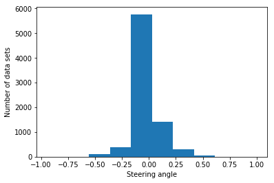
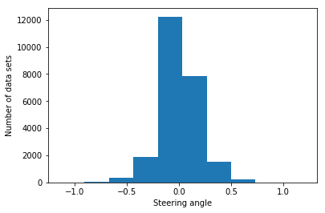
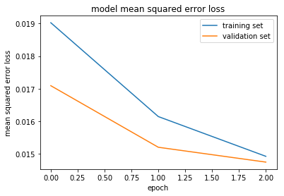

# **Behavioral Cloning Project** 

---

The goals / steps of this project are the following:
* Use the simulator to collect data of good driving behavior
* Build, a convolution neural network in Keras that predicts steering angles from images
* Train and validate the model with a training and validation set
* Test that the model successfully drives around track one without leaving the road
* Summarize the results with a written report


[//]: # (Image References)

[image1]: ./histogram_new_data_set.png "Model Visualization"
[image2]: ./histogram_raw.png "Grayscaling"
[image3]: ./mean_square_error.png "Recovery Image"
[image4]: ./video.gif "Recovery Image"

---
### Files Submitted & Code Quality

#### 1. Submission includes all required files and can be used to run the simulator in autonomous mode

My project includes the following files:
* model.py containing the script to create and train the model
* drive.py for driving the car in autonomous mode
* model.h5 containing a trained convolution neural network 
* writeup_report.md or writeup_report.pdf summarizing the results

#### 2. Submission includes functional code
Using the Udacity provided simulator and my drive.py file, the car can be driven autonomously around the track by executing 
```sh
python drive.py model.h5
```

#### 3. Submission code is usable and readable

The model.py file contains the code for training and saving the convolution neural network. The file shows the pipeline I used for training and validating the model, and it contains comments to explain how the code works.

### Model Architecture and Training Strategy

#### 1. An appropriate model architecture has been employed

NVIDIA autonomous vehicle team's model architecture has been implemented in this project (model.py lines 92-103). Model consists of 5 convolutional layers with different depths ranging from 24 to 64 and filter sizes of 5x5 and 3x3. Output of each layer is activated by 'ReLu' function. The model includes RELU layers to introduce nonlinearity (code line 20), and the data is normalized in the model using a Keras lambda layer (code line 93). Following these layers flatten and fully connected layers with different depths 100, 50, 1 are added to the model. 

#### 2. Attempts to reduce overfitting in the model

The model architecture was not modified by adding dropout layers. As this project was done using a CPU, the number of epochs used for training the model are kept low (3). The training and validation loss obtained using 3 epochs is considerably low and is decreasing through out training and validation process. Also, the model was trained and validated on different data sets to ensure that the model was not overfitting (code line 10-16). As overfitting was not observed, dropout layers have not been added.

The model was tested by running it through the simulator and ensuring that the vehicle could stay on the track.

#### 3. Model parameter tuning

The model used an adam optimizer, so the learning rate was not tuned manually (model.py line 105).

#### 4. Appropriate training data

Training data was chosen to keep the vehicle driving on the road. I used the data provided by Udacity to train the model to drive on first track. The image data from simulator's cameras - left, center and right, was used to train the model. 

For details about how I created the training data, see the next section. 

### Model Architecture and Training Strategy

#### 1. Solution Design Approach

My first step was to use a convolution neural network model similar to the Yan LeCunn's LeNet model architecture. The data for training and validation is obtained by splitting the collector simulator data in the ratio 4:1. I thought this model might be appropriate because it is one of the powerful models and performed very well in classifying traffic sign images (project-2). However, this architecture failed to drive the vehicle on road autonomously. So, I tried another model architecture which is even more powerful than LeNet, i.e, NVIDIA's CNN. When I attempted this architecture, the car drove further more distance but eventually went off the track. To overcome this issue, I decided to change/ increase the data used for training the model. 

Intially, I used the image data from center camera to train the model. But, Image data from side camera's can teach the model to steer back to the center when it drifts sideways. So, I decided to utilize the data provided by the left and right cameras. The corresponding steering angles for the left and right camera images are obatined by adding/subtracting a correction factor from the center steering angle. This correction factor is chosen to be 0.2 in this project. The code for combining the data from all camera's is implemented in 'gen_data' fuction. 

Histogram shows the first set of steering angle data used for model training (center camera):



Histogram shows the second set of steering angle data used for model training (left, center and right camera's):



Combining the data from left and right camera's reduced the bias of steering angle towards 0 deg.

The data for training and validation is pulled according to the requirement using 'generator' function, which also converts the data from BGR to RGB colorspace. The final step was to run the simulator to see how well the car was driving around track one. At the end of the process, the vehicle is able to drive autonomously around the track without leaving the road.

#### 2. Final Model Architecture

The final model architecture (model.py lines 92-103) consisted of a convolution neural network with the following layers and layer sizes 

| Layer         		|     Description	        					| 
|:---------------------:|:---------------------------------------------:| 
| Input image       | 160x320x3   |
| Lambda layer    |  Normalization of image   |
|Convolution 1   |  5x5 filter, layer depth =24 and ReLu activation   |
|Convolution 2   |  5x5 filter, layer depth =36 and ReLu activation   |
|Convolution 3   |  5x5 filter, layer depth =48 and ReLu activation   |
|Convolution 4   |  3x3 filter, layer depth =64 and ReLu activation   |
|Convolution 5   |  3x3 filter, layer depth =64 and ReLu activation   |
|Flatten |    |
|Dense 1 | Output size = 100 |
|Dense 2 | Output size = 50 |
|Dense 3 | Output size = 1 |

#### 3. Creation of the Training Set & Training Process

The data set provided by Udacity has been used and I haven't collected my own simulator data. I used this data for training the model using 'fit_generator' function. The plot below shows the decrease in loss of training and validation sets with number of epochs.



#### 4. Vehicle Simulation

The below GIF shows simulation of autonomous vehicle model using the architecture described above. The vehicle drove well in Track-1, but failed to do the same in Track-2.


##### Some afterthoughts for improvement:

1. The model failed to run on Track-2 as it was trained on Track-1 data set. However, as Track-2 is quite different from Track-1, generating Track-2 driving data from simulator and using it for training can definitely improve the performance of the model on Track-2.

2. Other than utlizing the data from three cameras, the data set can be enlarged by flipping images, adjusting brightness, rotating images and shearing images. Doing this not only increases the amount of data for training, but also makes the model robust to a variety of driving environment conditions.
